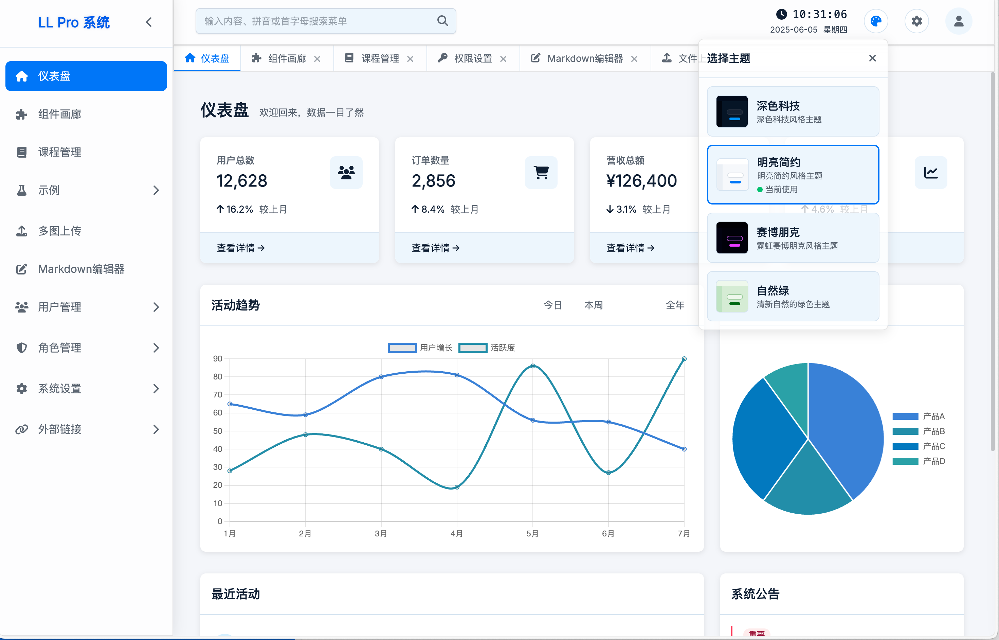
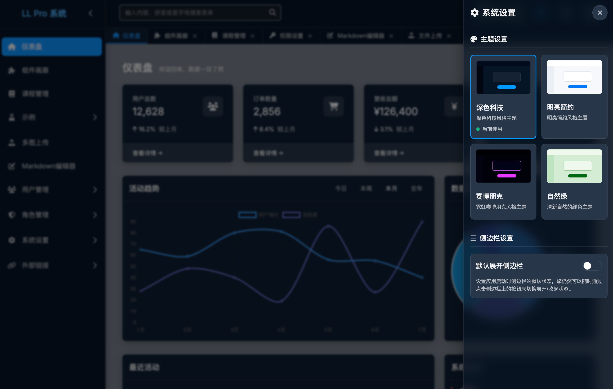
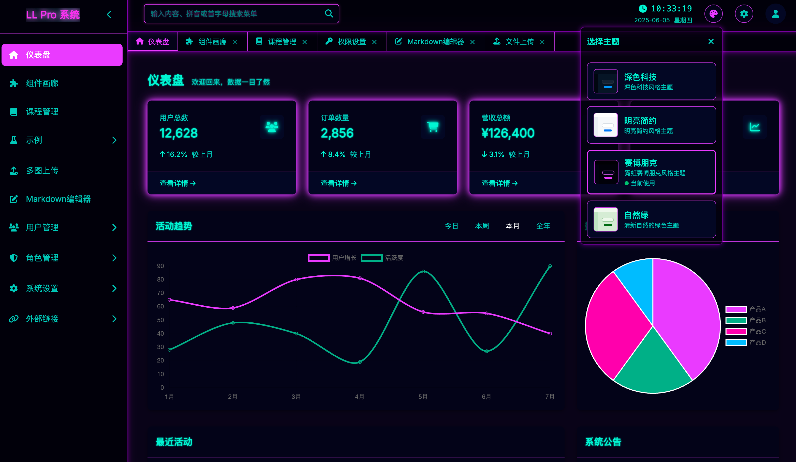
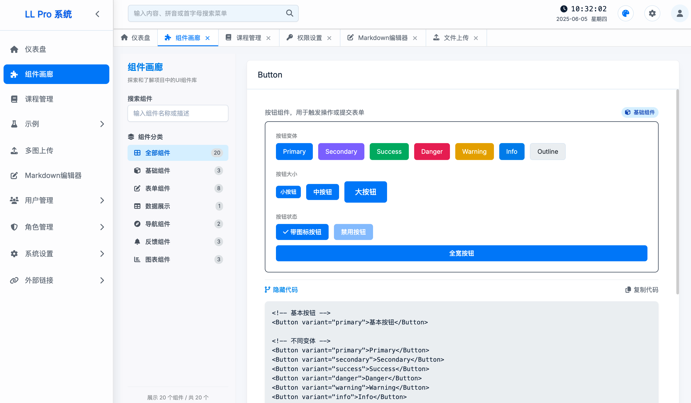
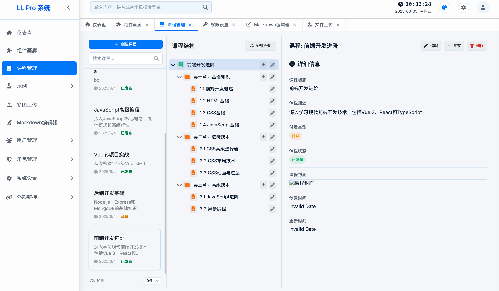
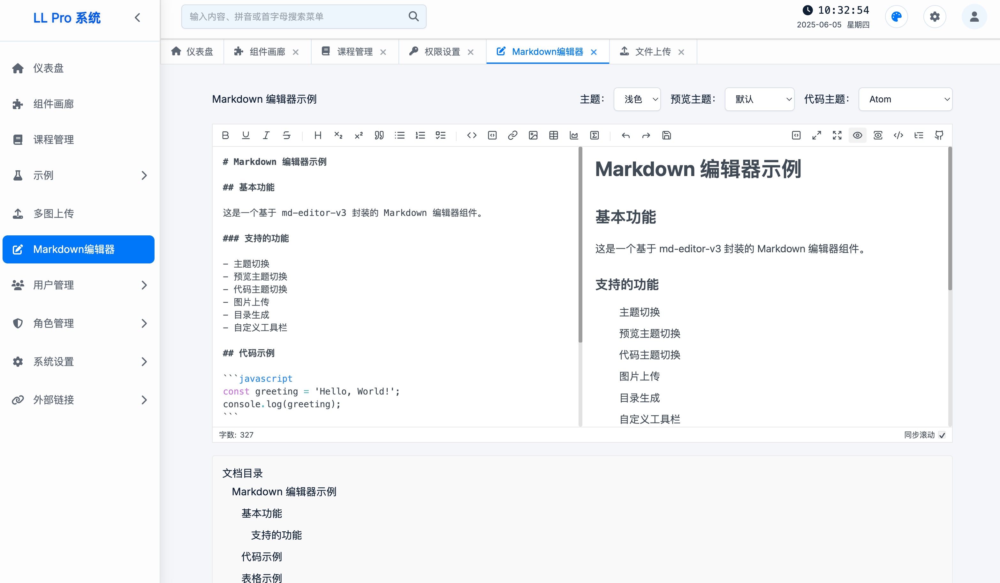
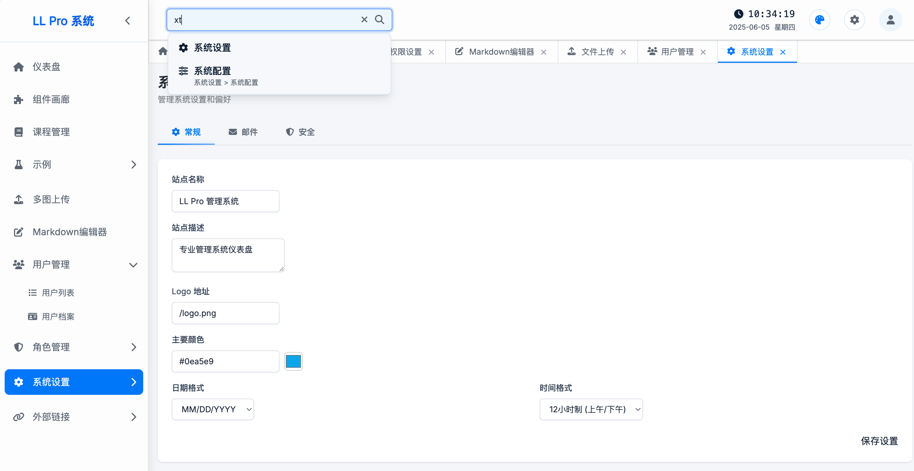
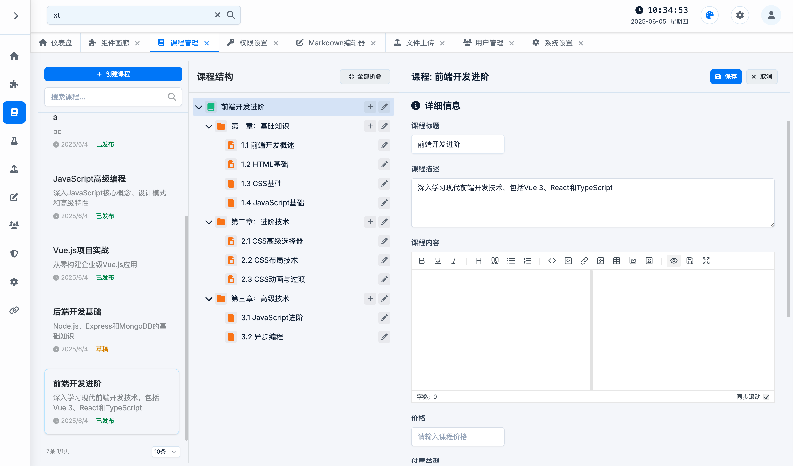

# LL Pro Admin Web (基于人工智能技术构建的后台管理系统)

<div align="center">









**一个现代化、功能丰富的后台管理系统**

基于 Vue 3 + Vite + Tailwind CSS 4 构建的企业级管理平台

[](https://vuejs.org/)
[](https://vitejs.dev/)
[](https://tailwindcss.com/)
[](LICENSE)

</div>

## ✨ 项目特色

- 🎨 **现代化UI设计** - 基于Tailwind CSS 4的响应式设计，支持多主题切换
- 🔐 **完整权限系统** - 用户管理、角色权限、细粒度访问控制
- 📚 **课程管理系统** - 支持课程、章节、小节的层级管理
- 📝 **富文本编辑** - 集成Markdown编辑器，支持实时预览和多种扩展
- 📊 **数据可视化** - 内置Chart.js图表组件，支持多种图表类型
- 🌙 **智能主题系统** - 支持亮色/暗色/赛博朋克等多种主题，自动适配系统偏好
- 📱 **响应式布局** - 完美适配桌面端、平板和移动设备
- 🚀 **开发体验优化** - 热重载、TypeScript支持、ESLint代码规范

## 🛠️ 技术栈

### 前端核心
- **Vue 3.5.16** - 渐进式JavaScript框架，使用Composition API
- **Vite 6.3.5** - 下一代前端构建工具，极速开发体验
- **Vue Router 4.5.1** - 官方路由管理器，支持动态路由和导航守卫
- **Pinia 3.0.2** - Vue官方状态管理库，替代Vuex

### 样式和UI
- **Tailwind CSS 4.1.8** - 实用优先的CSS框架，支持原生主题系统
- **Font Awesome** - 丰富的图标库
- **Inter字体** - 现代化的系统字体

### 功能增强
- **Axios 1.9.0** - HTTP客户端，支持请求/响应拦截
- **Chart.js 4.4.9** - 灵活的图表库
- **md-editor-v3** - 功能强大的Markdown编辑器
- **Mermaid** - 图表和流程图渲染
- **KaTeX** - 数学公式渲染
- **Cropper.js** - 图片裁剪功能

### 后端服务
- **Express 5.1.0** - Node.js Web框架，提供Mock API服务
- **Prisma 6.9.0** - 现代化数据库ORM
- **SQLite** - 轻量级数据库，用于开发和演示

### 开发工具
- **ESLint** - 代码质量检查
- **Prettier** - 代码格式化
- **Jest** - 单元测试框架
- **Nodemon** - 开发服务器自动重启

## 🎯 核心功能

### 🏠 仪表盘
- 数据概览和统计图表
- 实时系统状态监控
- 快捷操作入口

### 👥 用户管理
- 用户列表查看和搜索
- 用户信息的增删改查
- 用户状态管理和批量操作
- 用户角色分配

### 🔑 权限管理
- 角色定义和权限分配
- 细粒度权限控制
- 权限继承和组合
- 动态权限验证

### 📚 课程管理
- 课程的创建、编辑和删除
- 章节和小节的层级管理
- 课程内容的富文本编辑
- 课程状态和定价管理

### 📁 文件管理
- 多文件上传支持
- 图片预览和裁剪
- 文件类型验证
- 上传进度显示

### 🎨 主题系统
- 4种内置主题（明亮、深色、赛博朋克、自然绿）
- 实时主题切换，无页面刷新
- 主题偏好记忆
- 系统主题自动适配
- 支持自定义主题扩展

### 📝 内容编辑
- Markdown实时编辑和预览
- 语法高亮支持
- 数学公式渲染
- 图表和流程图支持
- 代码块美化

## 📁 项目结构

```
ll_pro_admin_web/
├── public/                     # 静态资源
│   ├── font-awesome/          # 图标字体
│   └── uploads/               # 上传文件存储
├── src/                       # 源代码
│   ├── api/                   # API接口定义
│   │   ├── auth.js           # 认证相关API
│   │   ├── users.js          # 用户管理API
│   │   ├── roles.js          # 角色权限API
│   │   ├── course.js         # 课程管理API
│   │   └── upload.js         # 文件上传API
│   ├── assets/               # 静态资源
│   ├── components/           # 可复用组件
│   │   ├── form/            # 表单组件
│   │   ├── charts/          # 图表组件
│   │   └── ...              # 其他UI组件
│   ├── config/              # 配置文件
│   │   └── menu.js          # 菜单配置
│   ├── layouts/             # 布局组件
│   │   └── MainLayout.vue   # 主布局
│   ├── router/              # 路由配置
│   │   └── index.js         # 路由定义
│   ├── stores/              # 状态管理
│   │   ├── auth.js          # 认证状态
│   │   ├── users.js         # 用户状态
│   │   ├── course.js        # 课程状态
│   │   └── theme.js         # 主题状态
│   ├── styles/              # 样式文件
│   │   ├── themes/          # 主题定义
│   │   └── main.css         # 主样式文件
│   ├── utils/               # 工具函数
│   │   ├── axios.js         # HTTP配置
│   │   └── errorHandler.js  # 错误处理
│   ├── views/               # 页面组件
│   │   ├── Dashboard.vue    # 仪表盘
│   │   ├── UserManagement.vue # 用户管理
│   │   ├── CourseManagement.vue # 课程管理
│   │   └── ...              # 其他页面
│   ├── App.vue              # 根组件
│   └── main.js              # 应用入口
├── mock-server/             # Mock服务器
│   ├── controllers/         # 控制器
│   ├── models/             # 数据模型
│   ├── routes/             # 路由定义
│   ├── prisma/             # 数据库配置
│   └── index.js            # 服务器入口
├── docs/                   # 文档
│   └── theme-system.md     # 主题系统文档
├── package.json            # 项目配置
├── vite.config.js          # Vite配置
├── tailwind.config.js      # Tailwind配置
└── README.md              # 项目说明
```

## 🚀 快速开始

### 环境要求

- **Node.js** >= 18.0.0
- **pnpm** >= 8.0.0 (推荐) 或 npm >= 9.0.0
- **Git** 用于版本控制

### 安装步骤

1. **克隆项目**
```bash
git clone https://github.com/duolabmeng6/llpro_admin_vue.git
cd llpro_admin_vue
```

2. **安装依赖**
```bash
# 使用 pnpm (推荐)
pnpm install

# 或使用 npm
npm install
```

3. **启动开发服务器**
```bash
# 同时启动前端和Mock服务器
pnpm run dev

# 或分别启动
pnpm run server  # 启动Mock服务器 (端口3000)
pnpm run dev     # 启动前端开发服务器 (端口5173)
```

4. **访问应用**
- 前端应用: http://localhost:5173
- Mock API: http://localhost:3000
- 默认登录账号: admin / admin123

### 构建部署

```bash
# 构建生产版本
pnpm run build

# 预览构建结果
pnpm run preview

# 代码检查
pnpm run lint

# 自动修复代码格式
pnpm run lint:fix

# 运行API测试
pnpm run test:api
```

## 🔧 配置说明

### 环境变量

创建 `.env` 文件来配置环境变量：

```env
# API服务器配置
VITE_API_BASE_URL=http://localhost:3000/api
VITE_UPLOAD_URL=http://localhost:3000

# 应用配置
VITE_APP_TITLE=LL Pro 管理系统
VITE_APP_VERSION=1.0.0

# Mock服务器配置
PORT=3000
DATABASE_URL="file:./dev.db"
```

### Vite配置

主要配置项在 `vite.config.js` 中：

```javascript
export default defineConfig({
  plugins: [vue(), vueJsx(), tailwindcss()],
  resolve: {
    alias: { '@': '/src' }
  },
  server: {
    proxy: {
      '/api': {
        target: 'http://localhost:3000',
        changeOrigin: true
      }
    }
  }
})
```

### 数据库配置

项目使用Prisma作为ORM，数据库配置在 `mock-server/prisma/schema.prisma`：

```prisma
generator client {
  provider = "prisma-client-js"
}

datasource db {
  provider = "sqlite"
  url      = env("DATABASE_URL")
}
```

初始化数据库：

```bash
cd mock-server
npx prisma migrate dev
npx prisma generate
```

## 🎨 主题系统详解

### 主题特性

LL Pro Admin 采用基于CSS变量的主题系统，具有以下特点：

- **无刷新切换** - 实时主题切换，用户体验流畅
- **偏好记忆** - 自动保存用户主题选择
- **系统适配** - 支持跟随系统的亮色/暗色模式
- **易于扩展** - 简单的配置即可添加新主题

### 内置主题

| 主题名称 | ID | 描述 | 适用场景 |
|---------|----|----- |---------|
| 明亮简约 | `light` | 清爽的白色主题，适合日间使用 | 办公环境、长时间阅读 |
| 深色科技 | `dark` | 深色主题，保护视力 | 夜间使用、开发环境 |
| 赛博朋克 | `cyberpunk` | 霓虹色彩，科技感十足 | 创意工作、演示展示 |
| 自然绿 | `green` | 清新的绿色主题 | 护眼需求、自然风格 |

### 主题切换方式

1. **手动切换** - 通过右上角主题切换器
2. **自动适配** - 跟随系统主题偏好
3. **程序控制** - 通过API编程切换

```javascript
// 在组件中切换主题
import { useThemeStore } from '@/stores/theme'

const themeStore = useThemeStore()
themeStore.setTheme('dark')
```

### 自定义主题

详细的主题自定义指南请参考：[主题系统文档](docs/theme-system.md)

## 📡 API接口文档

### 认证接口

```http
POST /api/auth/login
Content-Type: application/json

{
  "username": "admin",
  "password": "admin123"
}
```

### 用户管理接口

```http
# 获取用户列表
GET /api/users?page=1&limit=10&search=keyword

# 创建用户
POST /api/users
Content-Type: application/json

{
  "username": "newuser",
  "email": "user@example.com",
  "password": "password123",
  "role": "user"
}

# 更新用户
PUT /api/users/:id

# 删除用户
DELETE /api/users/:id
```

### 课程管理接口

```http
# 获取课程列表
GET /api/courses?page=1&limit=10&status=published

# 获取课程详情
GET /api/courses/:id

# 获取课程结构（包含章节和小节）
GET /api/courses/:id/structure

# 创建课程
POST /api/courses
Content-Type: application/json

{
  "title": "新课程",
  "description": "课程描述",
  "content": "课程内容",
  "price": 99.00,
  "pricingType": "paid",
  "status": "draft"
}
```

### 文件上传接口

```http
# 上传单个图片
POST /api/upload/image
Content-Type: multipart/form-data

# 上传多个图片
POST /api/upload/images
Content-Type: multipart/form-data

# 删除图片
DELETE /api/upload/images/:id
```

### 响应格式

成功响应：
```json
{
  "data": { ... },
  "meta": {
    "currentPage": 1,
    "pageSize": 10,
    "totalItems": 100,
    "totalPages": 10
  }
}
```

错误响应：
```json
{
  "error": "错误信息",
  "code": "ERROR_CODE",
  "details": { ... }
}
```

## 👨‍💻 开发指南

### 代码规范

项目使用ESLint和Prettier确保代码质量：

```bash
# 检查代码规范
pnpm run lint

# 自动修复格式问题
pnpm run lint:fix
```

### 组件开发

1. **组件命名** - 使用PascalCase命名
2. **文件结构** - 每个组件一个文件
3. **Props定义** - 使用TypeScript类型或PropTypes
4. **事件命名** - 使用kebab-case

示例组件结构：
```vue
<script setup>
import { ref, computed } from 'vue'

// Props定义
const props = defineProps({
  title: {
    type: String,
    required: true
  },
  variant: {
    type: String,
    default: 'primary'
  }
})

// 事件定义
const emit = defineEmits(['click', 'change'])

// 响应式数据
const isActive = ref(false)

// 计算属性
const classes = computed(() => ({
  'btn': true,
  [`btn-${props.variant}`]: true,
  'btn-active': isActive.value
}))
</script>

<template>
  <button :class="classes" @click="emit('click')">
    {{ title }}
  </button>
</template>

<style scoped>
.btn {
  @apply px-4 py-2 rounded transition-colors;
}
</style>
```

### 状态管理

使用Pinia进行状态管理，Store结构：

```javascript
import { defineStore } from 'pinia'

export const useExampleStore = defineStore('example', {
  state: () => ({
    items: [],
    loading: false,
    error: null
  }),

  getters: {
    itemCount: (state) => state.items.length,
    hasError: (state) => !!state.error
  },

  actions: {
    async fetchItems() {
      this.loading = true
      this.error = null

      try {
        const response = await api.getItems()
        this.items = response.data
      } catch (error) {
        this.error = error.message
      } finally {
        this.loading = false
      }
    }
  }
})
```

### 路由配置

添加新路由的步骤：

1. 在 `src/views/` 创建页面组件
2. 在 `src/router/index.js` 添加路由配置
3. 在 `src/config/menu.js` 添加菜单项（如需要）

```javascript
// 路由配置示例
{
  path: '/new-feature',
  name: 'NewFeature',
  component: () => import('../views/NewFeature.vue'),
  meta: {
    title: '新功能',
    icon: 'fa-star',
    requiresAuth: true
  }
}
```

### API集成

创建新的API服务：

```javascript
// src/api/newService.js
import http from '../utils/axios'

export const newServiceAPI = {
  getList: (params) => http.get('/new-service', { params }),
  getById: (id) => http.get(`/new-service/${id}`),
  create: (data) => http.post('/new-service', data),
  update: (id, data) => http.put(`/new-service/${id}`, data),
  delete: (id) => http.delete(`/new-service/${id}`)
}
```

## 🚀 部署指南

### 生产环境构建

```bash
# 构建生产版本
pnpm run build

# 构建产物在 dist/ 目录
ls dist/
```

### 静态部署

适用于Nginx、Apache等静态服务器：

```nginx
# Nginx配置示例
server {
    listen 80;
    server_name your-domain.com;
    root /path/to/dist;
    index index.html;

    # 处理Vue Router的history模式
    location / {
        try_files $uri $uri/ /index.html;
    }

    # 静态资源缓存
    location ~* \.(js|css|png|jpg|jpeg|gif|ico|svg)$ {
        expires 1y;
        add_header Cache-Control "public, immutable";
    }
}
```

### Docker部署

```dockerfile
# Dockerfile
FROM node:18-alpine AS builder

WORKDIR /app
COPY package*.json ./
RUN npm ci --only=production

COPY . .
RUN npm run build

FROM nginx:alpine
COPY --from=builder /app/dist /usr/share/nginx/html
COPY nginx.conf /etc/nginx/nginx.conf

EXPOSE 80
CMD ["nginx", "-g", "daemon off;"]
```

### 环境变量配置

生产环境的环境变量：

```env
# .env.production
VITE_API_BASE_URL=https://api.your-domain.com
VITE_APP_TITLE=LL Pro 管理系统
VITE_APP_VERSION=1.0.0
```

### 性能优化建议

1. **代码分割** - 使用动态导入分割路由
2. **资源压缩** - 启用gzip/brotli压缩
3. **CDN加速** - 静态资源使用CDN
4. **缓存策略** - 合理设置缓存头
5. **监控告警** - 部署性能监控

## ❓ 常见问题

### 安装问题

**Q: 安装依赖时出现网络错误**
```bash
# 使用国内镜像源
pnpm config set registry https://registry.npmmirror.com/
pnpm install
```

**Q: Node.js版本不兼容**
```bash
# 使用nvm管理Node.js版本
nvm install 18
nvm use 18
```

### 开发问题

**Q: 热重载不工作**
- 检查防火墙设置
- 确认端口5173未被占用
- 重启开发服务器

**Q: API请求失败**
- 确认Mock服务器已启动（端口3000）
- 检查代理配置是否正确
- 查看浏览器控制台错误信息

**Q: 主题切换不生效**
- 清除浏览器缓存
- 检查localStorage中的主题设置
- 确认CSS变量定义正确

### 构建问题

**Q: 构建失败**
```bash
# 清除缓存重新构建
rm -rf node_modules dist
pnpm install
pnpm run build
```

**Q: 构建产物过大**
- 检查是否正确使用动态导入
- 分析bundle大小：`pnpm run build --analyze`
- 移除未使用的依赖

## 🤝 贡献指南

我们欢迎所有形式的贡献！

### 贡献方式

1. **报告Bug** - 在Issues中详细描述问题
2. **功能建议** - 提出新功能的想法和需求
3. **代码贡献** - 提交Pull Request
4. **文档改进** - 完善项目文档
5. **测试用例** - 增加测试覆盖率

### 开发流程

1. **Fork项目** 到你的GitHub账号
2. **创建分支** `git checkout -b feature/amazing-feature`
3. **提交更改** `git commit -m 'Add some amazing feature'`
4. **推送分支** `git push origin feature/amazing-feature`
5. **创建Pull Request**

### 代码规范

- 遵循ESLint配置的代码规范
- 提交信息使用[约定式提交](https://www.conventionalcommits.org/)
- 添加必要的测试用例
- 更新相关文档

### 提交信息格式

```
type(scope): description

[optional body]

[optional footer]
```

类型说明：
- `feat`: 新功能
- `fix`: 修复bug
- `docs`: 文档更新
- `style`: 代码格式调整
- `refactor`: 代码重构
- `test`: 测试相关
- `chore`: 构建过程或辅助工具的变动

## 📄 许可证

本项目基于 [MIT License](LICENSE) 开源协议。

## 🙏 致谢

感谢以下开源项目和贡献者：

- [Vue.js](https://vuejs.org/) - 渐进式JavaScript框架
- [Vite](https://vitejs.dev/) - 下一代前端构建工具
- [Tailwind CSS](https://tailwindcss.com/) - 实用优先的CSS框架
- [Pinia](https://pinia.vuejs.org/) - Vue状态管理库
- [Chart.js](https://www.chartjs.org/) - 简单而灵活的图表库
- [Prisma](https://www.prisma.io/) - 现代化数据库工具包

## 📞 联系我们

- **项目主页**: [GitHub Repository](https://github.com/duolabmeng6/llpro_admin_vue)
- **问题反馈**: [GitHub Issues](https://github.com/duolabmeng6/llpro_admin_vue/issues)
- **讨论交流**: [GitHub Discussions](https://github.com/duolabmeng6/llpro_admin_vue/discussions)

## 💖 支持项目

如果这个项目对你有帮助，请考虑给我们一个⭐️！

你也可以通过以下方式支持我们：

<div align="center">


**扫码支持项目发展**

</div>

---

<div align="center">

**[⬆ 回到顶部](#ll-pro-admin-web)**

Made with ❤️ by LL Pro Team

</div>